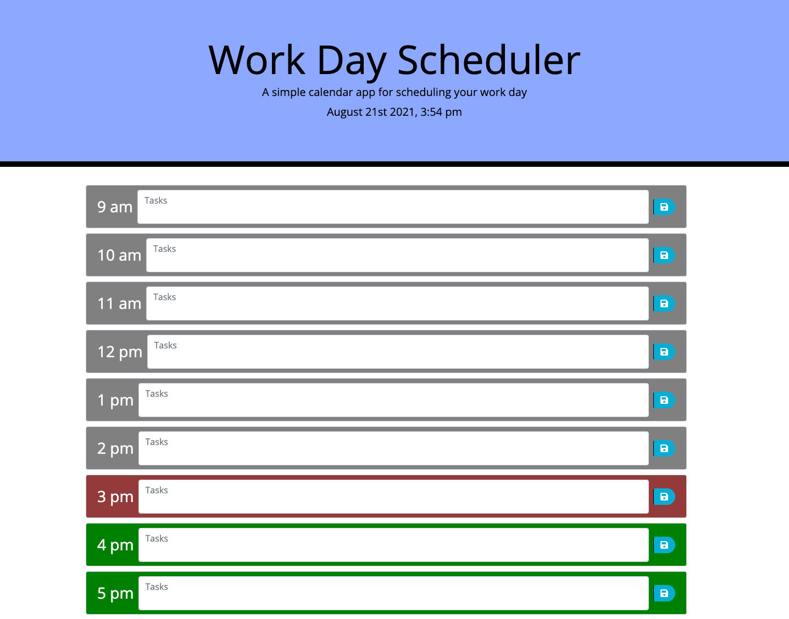

# Work Day Scheduler

## by Charlotte Clark

## Technologies used
* HTML
* CSS
* JavaScript

## Acceptance Criteria
When you open the planner, the current date and time is displayed at the top.
When you scroll down, you will see timeblocks corresponding with standard business hours.
Each timeblock is color coded to indicate whether it is in the past, present, or future. 
* Past = gray
* Present = red
* Future = green
You can type in the time blocks and hit the save button to save that event in that time block. 
To clear that event, just delete the text and save again.
--- 
https://charlocc.github.io/workdayscheduler/

## Licensing
The MIT License (MIT)

Copyright (c) 2021 Charlotte Clark

Permission is hereby granted, free of charge, to any person obtaining a copy of this software and associated documentation files (the "Software"), to deal in the Software without restriction, including without limitation the rights to use, copy, modify, merge, publish, distribute, sublicense, and/or sell copies of the Software, and to permit persons to whom the Software is furnished to do so, subject to the following conditions:

The above copyright notice and this permission notice shall be included in all copies or substantial portions of the Software.

THE SOFTWARE IS PROVIDED "AS IS", WITHOUT WARRANTY OF ANY KIND, EXPRESS OR IMPLIED, INCLUDING BUT NOT LIMITED TO THE WARRANTIES OF MERCHANTABILITY, FITNESS FOR A PARTICULAR PURPOSE AND NONINFRINGEMENT. IN NO EVENT SHALL THE AUTHORS OR COPYRIGHT HOLDERS BE LIABLE FOR ANY CLAIM, DAMAGES OR OTHER LIABILITY, WHETHER IN AN ACTION OF CONTRACT, TORT OR OTHERWISE, ARISING FROM, OUT OF OR IN CONNECTION WITH THE SOFTWARE OR THE USE OR OTHER DEALINGS IN THE SOFTWARE.
